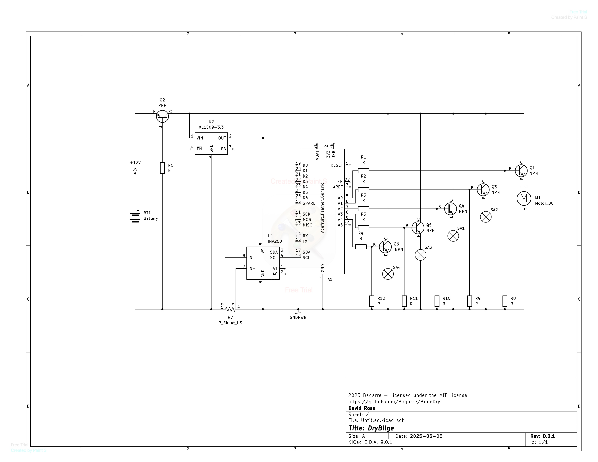

# BilgeDry: Smart Dry Bilge Controller

This project automates the dry bilge management for a boat using:
- A small self-priming pump
- 3–4 water solenoids (one per bilge region)
- Adafruit INA260 current sensor
- NMEA 2000 network for status/command messages

## Features
- Hourly pump cycle with individual zone check
- Pump runs only when current draw indicates water
- Automatic shutoff after 3 minutes
- INA260-based diagnostics (dry run, overload, sensor fail)
- EEPROM logging per zone
- NMEA2000 messaging for status and zone control

## Hardware
- Feather M4 CAN Express
- INA260 on I2C
- MOSFETs controlling each solenoid and pump
- NMEA2000 shield or transceiver

## Pin Assignments
- `PUMP_PIN`: GPIO 5
- `SOLENOID_PINS`: GPIOs 6–9 (changeable in `config.h`)

## Wiring
Each solenoid and pump should be controlled via an N-channel MOSFET with flyback diode. INA260 should be placed inline with the pump.

## Messages
- `PGN 130822`: Dry bilge status per zone
- Startup test and fault messages also reported over N2K

## EEPROM Logs
Each zone's last run is stored:
- Timestamp
- Peak current (mA)
- Duration (ms)
- Result (OK, DRY, TIMEOUT, FAIL)

## Future Work
- Add NMEA2000 command receiver for manual overrides
- Enable more detailed diagnostics or remote reset
