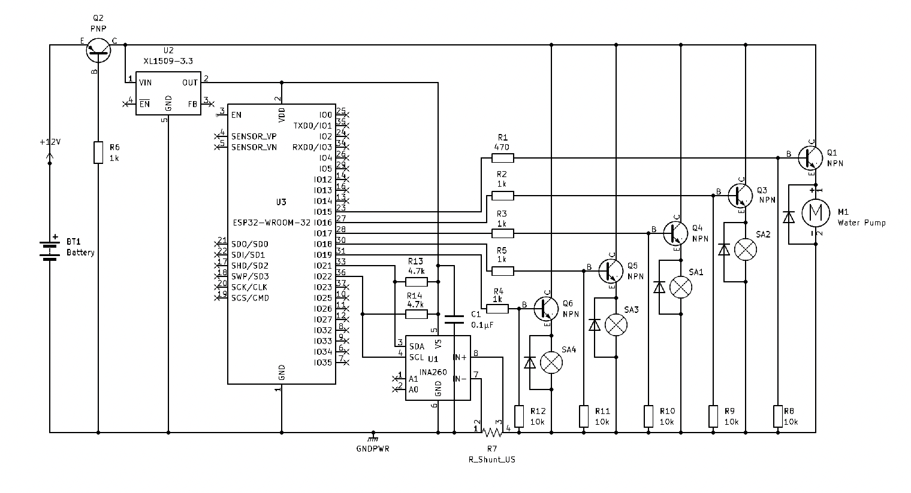

# BilgeDry - Dry Bilge Pump Controller

This ESP32-based system monitors and removes small amounts of water in dry bilge compartments. It controls a self-priming pump and up to 4 solenoid valves (zones), cycling them to check for water.

## Overview



- Solenoids are opened one at a time and the pump is monitored for amperage to detect water.
- Cycle repeats every 60 minutes by default.
- If water is detected (higher than idle current), the zone remains open for a longer duration.
- All configuration is saved in SPIFFS.

## Configuration File

The config file (`/config.json`) contains:
- `interval`: minutes between cycles
- `zones`: array of objects with:
  - `name`: zone label
  - `pin`: GPIO pin controlling solenoid
  - `amp`: expected water flow current (float)
  - `enabled`: boolean

Example:
```json
{
  "interval": 60,
  "zones": [
    { "name": "Aft Bilge", "pin": 16, "amp": 2.3, "enabled": true }
  ]
}
```

## Requirements

- ESP32 Dev Board
- INA260 for current sensing
- 12V pump + solenoids
- Web UI for configuration/status


---


# BilgeDry ESP32 System

This project implements a Wi-Fi-enabled dry bilge monitoring and control system using an ESP32. It serves a modern web UI via a built-in access point and supports JSON configuration and status reporting over a REST API.

---

## 🔧 Features

- **ESP32-hosted web interface** (works well on phones)
- REST API:
  - `GET /api/v1/status`: JSON status of zones and pump
  - `GET /api/v1/config`: Current configuration
  - `POST /api/v1/config`: Save configuration (zones, interval, Wi-Fi)
- **Web UI (in `/webroot`)**:
  - Configurable zones (name, pin, amps, enabled toggle)
  - Interval configuration (in minutes)
  - Real-time status page
- **Switch-style UI toggles** for zone enable/disable
- **Defaults to 4 zones**
- **3.3V operation** (you can bypass onboard regulator with a 3.3V buck into `3V3`)
- ESP32 runs in **softAP mode by default**:
  - SSID: `BilgeDry`
  - Password: `KIA2GZ4`

---

## 📁 File Structure

```
webroot/
├── index.html         # Status UI
├── config.html        # Configuration UI
├── js/
│   ├── status.js      # Fetch and display /api/v1/status
│   └── config.js      # Fetch and POST /api/v1/config
└── css/
    └── style.css      # Clean, responsive styling and toggle switches
```

---

## 🧪 Uploading to ESP32

1. Place `webroot/` into SPIFFS using ESP32FS.
2. Flash `main.ino` with the Arduino IDE.
3. Upload SPIFFS:
   - Tools > ESP32 Sketch Data Upload
4. Visit `http://192.168.4.1` when connected to ESP32 softAP.

---

## ⚠️ Power Notes

- The ESP32 operates at **3.3V logic** and is **not 5V-tolerant**.
- You can safely **power the board directly from a regulated 3.3V buck converter** via the `3V3` pin.
  - Do **not connect USB at the same time** unless your board isolates the onboard regulator.
- USB power (5V) is acceptable but can cause **overheating** on some cheap dev boards.

---

## 🔄 Defaults

- 4 zones initialized with:
  - Name: `Zone 1` to `Zone 4`
  - Pin: `0`
  - Enabled: `true`
- Default run interval: `60 minutes`

---

## 📞 API Example

```http
GET /api/v1/status
{
  "pumpAmps": 2.3,
  "interval": 60,
  "zones": [
    {
      "id": 0,
      "name": "Zone 1",
      "status": "Idle",
      "lastRun": 892334,
      "pin": 16,
      "enabled": true
    },
    ...
  ]
}
```

---

## 🤝 Credits

Built with ❤️ on ESP32 using AsyncWebServer, SPIFFS, and ArduinoJson.
